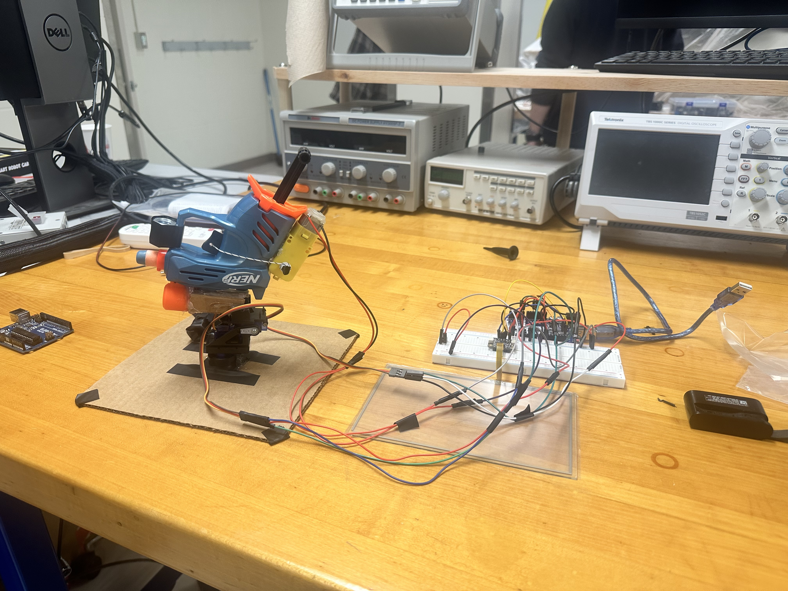

# UVM Microcontroller Systems Final Project
For the Final Project in Microcontroller Systems, Jack and I attempted to create real-life Angry Birds. This game involved launching a bird (a projectile) at objects (the pigs) using a slingshot (a Nerf blaster). The game was controlled using an Arduino, servos, a stepper motor, and a touchpad. The functionality, assembly, and code are available on this page.

Authors: Aaron Wilson and Jack Donovan

## The Final Design

The user can command the servo actuation via the touchpad by dragging their finger across the screen. The servos will only move while the finger is on the screen 

## Getting Started
### Hardware List
The required components for this project include:
-  An Arduino
-  An Adafruit TSC2007 Resistive Touch Screen and I2C Controller
-  Servos and a 3D-printed Gimbal
-  A Nerf Blaster
-  A DC Motor
-  A Battery Pack (for the DC motor)
-  A Button (for trigger actuation)

### Software List
The required components for this project include:
-  Arduino IDE (only to make changes and upload the code)
-  From the Library Manager on IDE:
   -  'Servo.h'
   -  'Adafruit_TSC2007.h'

### Usage Instructions
1. Download the .ino file from this repository
2. Connect the components as seen in the diagram below
3. Ensure the required libraries are installed on your device
4. Open this file via Arduino IDE
5. Run the downloaded file
6. Use the touchscreen to now command your sentry!

### Thank you!

